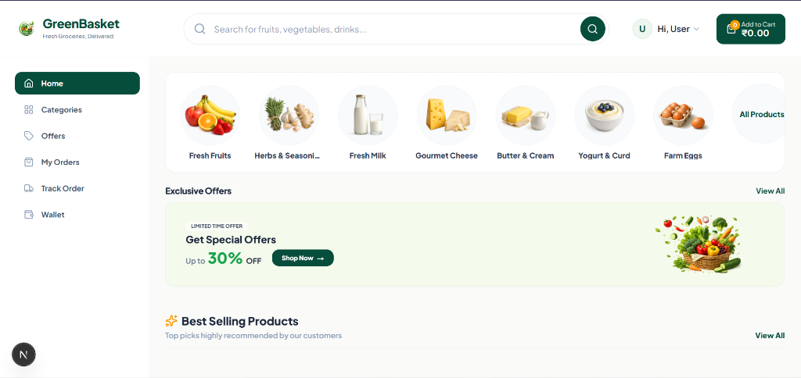
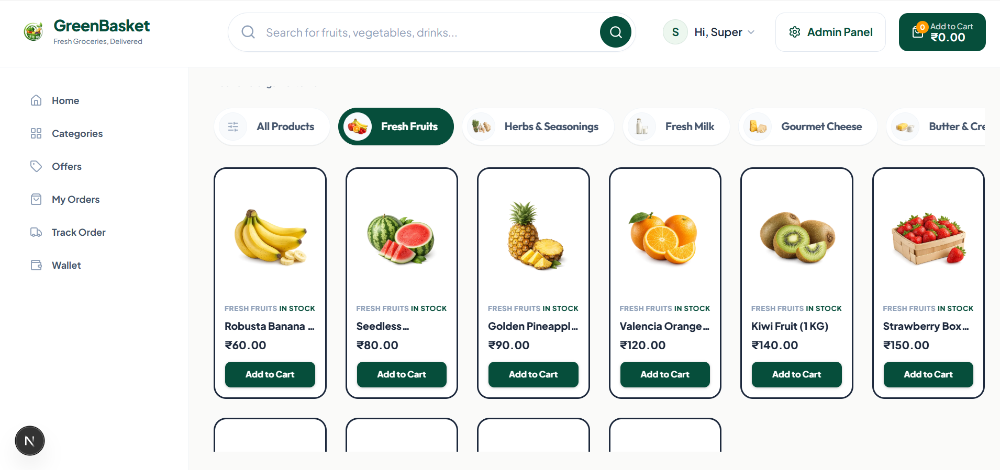
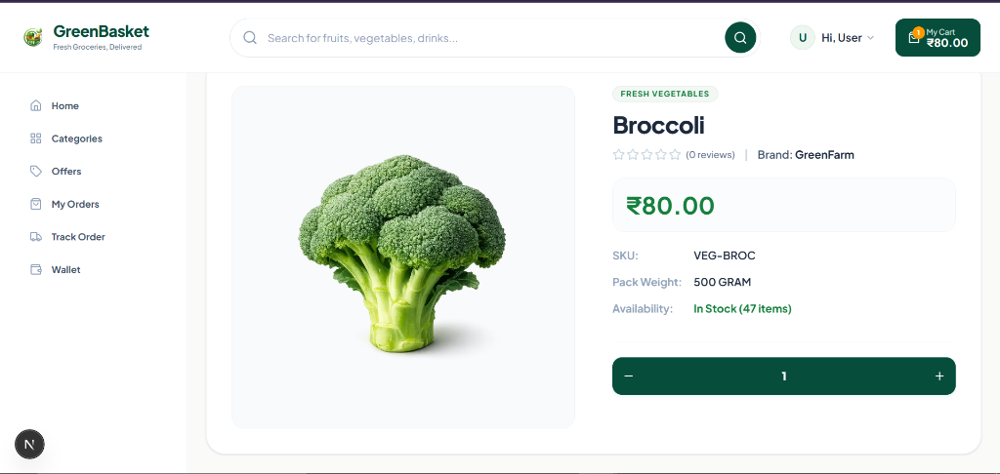
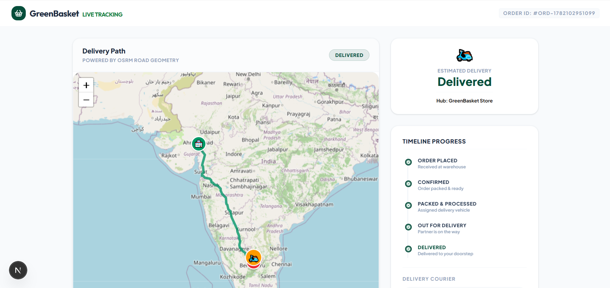
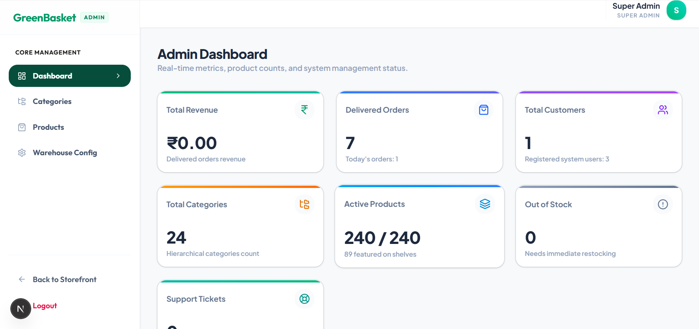
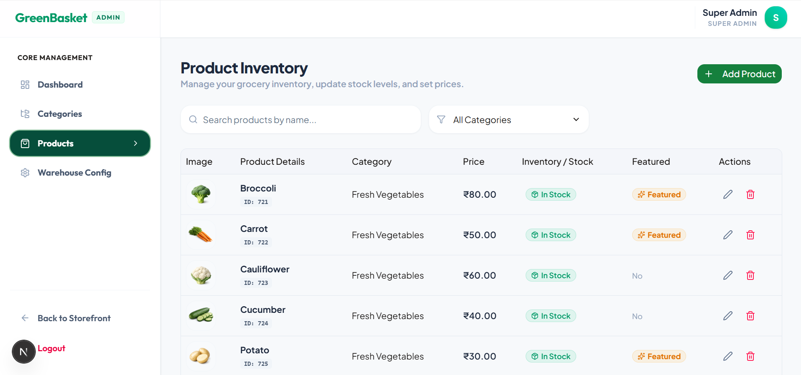

# GreenBasket 🧺

GreenBasket is a premium, feature-complete, and security-hardened e-commerce platform for organic grocery shopping. Built using a modern and high-performance stack—**Spring Boot (Java 21)** on the backend and **Next.js 15 (TypeScript & Tailwind CSS)** on the frontend—it delivers an extremely polished user experience, interactive maps, secure wallet system, and dynamic administrative tools.

---

## 📸 Screenshots

Here are visual highlights of the GreenBasket storefront and administrative panel:

### 1. Storefront Home Page


### 2. Product Catalog


### 3. Product Details


### 4. Interactive Order Tracking (OSRM Map Integration)


### 5. Admin Dashboard


### 6. Admin Product Management


---

## 🚀 Key Features

### Customer Experience
* **Smart Catalog & Navigation**: Browse 24 distinct grocery categories and over 240 products with dynamic filtering and real-time search.
* **Shopping Cart & Checkout**: Interactive slider cart, coupon/discount code support, and multi-step secure checkout.
* **Integrated Wallet System**: Secure pre-paid wallet for instant order payment, refund processing, and balance tracking.
* **Real-time Order Tracking**: Dynamic routing and delivery courier location rendering using OSRM (Open Source Routing Machine) map visualization.
* **Customer Profile**: Manage delivery addresses, view order history, and monitor active orders.

### Administrative Tools
* **Metrics Dashboard**: Visualized summary of sales, daily orders, active users, and low-inventory warnings.
* **Inventory Control**: Real-time warehouse monitoring, stocks adjustment, and automatic warning thresholds.
* **Catalog Management**: Creation, modification, and deletion of categories and product specifications.
* **Order Fulfillment**: Track all customer orders, modify fulfillment status (e.g. Preparing, Out for Delivery, Completed), and inspect details.

### Security Hardening
* **JWT Authentication**: Full access token + HTTP-Only secure cookie refresh token rotation flow.
* **Role-Based Access Control (RBAC)**: Distinct permissions for `CUSTOMER` and `ADMIN` roles.
* **Input Validation**: Strictly enforced schemas using `Zod` (frontend) and `Jakarta Validation` (backend).
* **Security Headers**: Standard OWASP protection headers including X-Frame-Options (DENY), Content-Type (nosniff), and Permissions Policy.
* **SQL Injection & XSS Mitigation**: Prepared statements and Flyway baseline migrations for database state security.

---

## 🛠️ Technology Stack

### Backend API
* **Language & Framework**: Java 21, Spring Boot 3.x
* **Security**: Spring Security, JWT (JSON Web Tokens)
* **Database**: MySQL 8.x
* **Migrations**: Flyway Database Migration
* **API Documentation**: SpringDoc OpenAPI / Swagger UI

### Frontend Storefront
* **Framework**: Next.js 15 (App Router with Turbopack compiler)
* **Language**: TypeScript
* **Styling**: Tailwind CSS
* **State Management**: Zustand (State stores for auth and cart)
* **Data Fetching**: TanStack React Query (Cached mutations & queries)
* **Form Validation**: React Hook Form with Zod schema resolver

---

## 📂 Project Structure

```
GreenBasket/
├── backend/
│   └── greenbasket-api/          # Spring Boot API Backend
│       ├── src/
│       ├── pom.xml
│       └── .env.example
├── frontend/                     # Next.js Storefront & Admin Portal
│   ├── src/
│   ├── public/
│   ├── package.json
│   └── .env.example
├── ScreenShot/                   # Portfolio visual gallery
├── required_images.md            # Image catalog & asset definitions
├── LICENSE                       # MIT License
└── README.md                     # Main documentation
```

---

## 🔧 Installation & Setup

### Prerequisites
* **Java Development Kit (JDK 21)**
* **Node.js (v18 or higher)**
* **MySQL Server (v8 or higher)**
* **Maven** (or use the provided `./mvnw` wrapper)

### 1. Database Setup
1. Log into your MySQL instance:
   ```sql
   CREATE DATABASE greenbasket CHARACTER SET utf8mb4 COLLATE utf8mb4_unicode_ci;
   CREATE USER 'greenbasket_user'@'localhost' IDENTIFIED BY 'greenbasket123';
   GRANT ALL PRIVILEGES ON greenbasket.* TO 'greenbasket_user'@'localhost';
   FLUSH PRIVILEGES;
   ```
2. Flyway migrations will automatically build the tables and insert seed data on application startup.

### 2. Backend API Setup
1. Navigate to the backend directory:
   ```bash
   cd backend/greenbasket-api
   ```
2. Copy `.env.example` to `.env` (or configure system variables):
   ```bash
   cp .env.example .env
   ```
3. Run migrations and start the backend:
   ```bash
   ./mvnw spring-boot:run
   ```
4. Access Swagger API Docs at: `http://localhost:8080/api/swagger-ui.html`

### 3. Frontend Storefront Setup
1. Navigate to the frontend directory:
   ```bash
   cd ../../frontend
   ```
2. Install npm dependencies:
   ```bash
   npm install
   ```
3. Copy `.env.example` to `.env.local`:
   ```bash
   cp .env.example .env.local
   ```
4. Start the Turbopack development server:
   ```bash
   npm run dev
   ```
5. Open your browser to: `http://localhost:3000`

---

## 🛡️ Security Section

GreenBasket enforces strict API-level and client-level security protocols:
* **Token Expiration**: Access tokens expire in 15 minutes, while refresh tokens reside in secure, `HttpOnly` and `SameSite` cookies with 7-day expirations.
* **Ownership Validation**: Every database mutation (such as wallet updates or address deletions) validates that the resource owner matches the authenticated user ID extracted from the JWT token.
* **Multipart File Limits**: Maximum upload size for administrative product images is constrained to 10MB to prevent denial of service (DoS) attacks via disk exhaustion.

---

## 📄 License

This project is licensed under the MIT License - see the [LICENSE](LICENSE) file for details.
